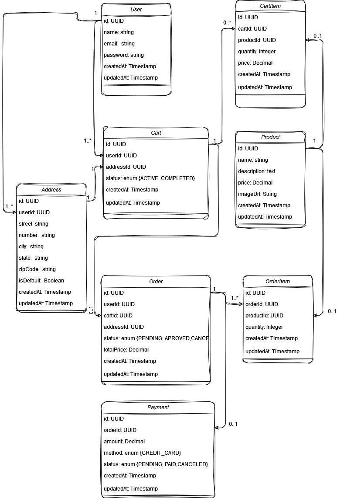

# 📊 Relatório do Banco de Dados - Sistema de E-commerce Simples

Este documento descreve as tabelas e colunas do banco de dados para o sistema de e-commerce, especificando os tipos e finalidades de cada campo. As tabelas foram projetadas para facilitar o gerenciamento de usuários, produtos, carrinhos, pedidos e endereços, visando um fluxo eficiente de cadastro e finalização de compras.

## 📁 Tabelas do Sistema

### 1. Tabela User

Armazena informações dos usuários do sistema.

<table><thead><tr><th>Campo</th><th>Tipo</th><th>Descrição</th></tr></thead><tbody><tr><td><code>id</code></td><td><code>UUID</code></td><td>Identificador único do produto</td></tr><tr><td><code>name</code></td><td><code>String</code></td><td>Nome do produto</td></tr><tr><td><code>description</code></td><td><code>String</code></td><td>Descrição do produto</td></tr><tr><td><code>price</code></td><td><code>Decimal</code></td><td>Preço do produto</td></tr><tr><td><code>imageUrl</code></td><td><code>String</code></td><td>URL da imagem do produto</td></tr><tr><td><code>createdAt</code></td><td><code>Timestamp</code></td><td>Data de criação do registro</td></tr><tr><td><code>updatedAt</code></td><td><code>Timestamp</code></td><td>Data da última atualização</td></tr></tbody></table>

### 2. Tabela Product

Armazena dados dos produtos disponíveis para venda.
<table><thead><tr><th>Campo</th><th>Tipo</th><th>Descrição</th></tr></thead><tbody><tr><td><code>id</code></td><td><code>UUID</code></td><td>Identificador único do produto</td></tr><tr><td><code>name</code></td><td><code>String</code></td><td>Nome do produto</td></tr><tr><td><code>description</code></td><td><code>String</code></td><td>Descrição do produto</td></tr><tr><td><code>price</code></td><td><code>Decimal</code></td><td>Preço do produto</td></tr><tr><td><code>imageUrl</code></td><td><code>String</code></td><td>URL da imagem do produto</td></tr><tr><td><code>createdAt</code></td><td><code>Timestamp</code></td><td>Data de criação do registro</td></tr><tr><td><code>updatedAt</code></td><td><code>Timestamp</code></td><td>Data da última atualização</td></tr></tbody></table>

### 3. Tabela Cart

Gerencia carrinhos de compra dos usuários.
<table><thead><tr><th>Campo</th><th>Tipo</th><th>Descrição</th></tr></thead><tbody><tr><td><code>id</code></td><td><code>UUID</code></td><td>Identificador único do carrinho</td></tr><tr><td><code>userId</code></td><td><code>UUID</code></td><td>Identificador do usuário (FK <code>User</code>)</td></tr><tr><td><code>addressId</code></td><td><code>UUID</code></td><td>Endereço de entrega (FK <code>Address</code>)</td></tr><tr><td><code>createdAt</code></td><td><code>Timestamp</code></td><td>Data de criação do registro</td></tr><tr><td><code>updatedAt</code></td><td><code>Timestamp</code></td><td>Data da última atualização</td></tr><tr><td><code>status</code></td><td><code>String</code></td><td>Status (<code>ACTIVE</code>, <code>COMPLETED</code>)</td></tr></tbody></table>

### 4. Tabela CartItem

Registra os itens adicionados ao carrinho de um usuário.
<table><thead><tr><th>Campo</th><th>Tipo</th><th>Descrição</th></tr></thead><tbody><tr><td><code>id</code></td><td><code>UUID</code></td><td>Identificador único do item no carrinho</td></tr><tr><td><code>cartId</code></td><td><code>UUID</code></td><td>Identificador do carrinho (FK <code>Cart</code>)</td></tr><tr><td><code>productId</code></td><td><code>UUID</code></td><td>Identificador do produto (FK <code>Product</code>)</td></tr><tr><td><code>quantity</code></td><td><code>Integer</code></td><td>Quantidade do produto no carrinho</td></tr><tr><td><code>price</code></td><td><code>Decimal</code></td><td>Preço unitário do produto</td></tr><tr><td><code>createdAt</code></td><td><code>Timestamp</code></td><td>Data de criação do registro</td></tr><tr><td><code>updatedAt</code></td><td><code>Timestamp</code></td><td>Data da última atualização</td></tr></tbody></table>

### 5. Tabela Order

Registra pedidos finalizados pelos usuários.
<table><thead><tr><th>Campo</th><th>Tipo</th><th>Descrição</th></tr></thead><tbody><tr><td><code>id</code></td><td><code>UUID</code></td><td>Identificador único do pedido</td></tr><tr><td><code>userId</code></td><td><code>UUID</code></td><td>Identificador do usuário (FK <code>User</code>)</td></tr><tr><td><code>cartId</code></td><td><code>UUID</code></td><td>Identificador do carrinho (FK <code>Cart</code>)</td></tr><tr><td><code>addressId</code></td><td><code>UUID</code></td><td>Endereço de entrega (FK <code>Address</code>)</td></tr><tr><td><code>status</code></td><td><code>String</code></td><td>Status do pedido (<code>PENDING</code>, <code>PAID</code>)</td></tr><tr><td><code>totalPrice</code></td><td><code>Decimal</code></td><td>Valor total do pedido</td></tr><tr><td><code>createdAt</code></td><td><code>Timestamp</code></td><td>Data de criação do pedido</td></tr><tr><td><code>updatedAt</code></td><td><code>Timestamp</code></td><td>Data da última atualização</td></tr></tbody></table>

### 6. Tabela OrderItem

Armazena os itens associados a um pedido específico.
<table><thead><tr><th>Campo</th><th>Tipo</th><th>Descrição</th></tr></thead><tbody><tr><td><code>id</code></td><td><code>UUID</code></td><td>Identificador único do item do pedido</td></tr><tr><td><code>orderId</code></td><td><code>UUID</code></td><td>Identificador do pedido (FK <code>Order</code>)</td></tr><tr><td><code>productId</code></td><td><code>UUID</code></td><td>Identificador do produto (FK <code>Product</code>)</td></tr><tr><td><code>quantity</code></td><td><code>Integer</code></td><td>Quantidade do produto no pedido</td></tr><tr><td><code>price</code></td><td><code>Decimal</code></td><td>Preço unitário do produto</td></tr><tr><td><code>createdAt</code></td><td><code>Timestamp</code></td><td>Data de criação do registro</td></tr><tr><td><code>updatedAt</code></td><td><code>Timestamp</code></td><td>Data da última atualização</td></tr></tbody></table>

### 7. Tabela Payment

Registra os pagamentos realizados para os pedidos.
<table><thead><tr><th>Campo</th><th>Tipo</th><th>Descrição</th></tr></thead><tbody><tr><td><code>id</code></td><td><code>UUID</code></td><td>Identificador único do pagamento</td></tr><tr><td><code>orderId</code></td><td><code>UUID</code></td><td>Identificador do pedido (FK <code>Order</code>)</td></tr><tr><td><code>amount</code></td><td><code>Decimal</code></td><td>Valor do pagamento</td></tr><tr><td><code>method</code></td><td><code>String</code></td><td>Método de pagamento (ex.: <code>CREDIT_CARD</code>)</td></tr><tr><td><code>status</code></td><td><code>String</code></td><td>Status do pagamento (<code>PENDING</code>, <code>PAID</code>)</td></tr><tr><td><code>createdAt</code></td><td><code>Timestamp</code></td><td>Data do pagamento</td></tr><tr><td><code>updatedAt</code></td><td><code>Timestamp</code></td><td>Data da última atualização</td></tr></tbody></table>

### 8. Tabela Address

Armazena endereços associados a usuários e carrinhos.
<table><thead><tr><th>Campo</th><th>Tipo</th><th>Descrição</th></tr></thead><tbody><tr><td><code>id</code></td><td><code>UUID</code></td><td>Identificador único do endereço</td></tr><tr><td><code>userId</code></td><td><code>UUID</code></td><td>Identificador do usuário (FK <code>User</code>)</td></tr><tr><td><code>street</code></td><td><code>String</code></td><td>Rua do endereço</td></tr><tr><td><code>number</code></td><td><code>String</code></td><td>Número do endereço</td></tr><tr><td><code>city</code></td><td><code>String</code></td><td>Cidade</td></tr><tr><td><code>state</code></td><td><code>String</code></td><td>Estado</td></tr><tr><td><code>zipCode</code></td><td><code>String</code></td><td>Código postal</td></tr><tr><td><code>country</code></td><td><code>String</code></td><td>País</td></tr><tr><td><code>createdAt</code></td><td><code>Timestamp</code></td><td>Data de criação do registro</td></tr><tr><td><code>updatedAt</code></td><td><code>Timestamp</code></td><td>Data da última atualização</td></tr><tr><td><code>isDefault</code></td><td><code>Boolean</code></td><td>Indica se é o endereço padrão do usuário</td></tr></tbody>

</table>
  

## 📊 Diagramas UML

### 📦 Diagrama de Classes

Este diagrama apresenta as classes principais do sistema, seus atributos, métodos e os relacionamentos entre elas.

## 🔁 Diagrama de Sequência

Este diagrama detalha a interação entre o usuário, carrinho, sistema e banco de dados para o processo de compra, destacando os métodos chamados em cada etapa.

(Em andamento...)

### 💡 Considerações Gerais

    Integridade Referencial: As Foreign Keys (FKs) garantem o vínculo entre tabelas relacionadas, como Cart -> User, Order -> Cart, entre outras.
    Campos de Auditoria: Campos como createdAt e updatedAt estão presentes em quase todas as tabelas, permitindo rastrear alterações.
    Escalabilidade e Manutenção: Estrutura modular permite que novas funcionalidades sejam integradas sem refatoração excessiva. Por exemplo, novos métodos de pagamento podem ser facilmente adicionados.
    Flexibilidade no Endereçamento: A tabela Address permite que cada usuário tenha múltiplos endereços, facilitando o envio para diferentes locais conforme necessário.

Este relatório serve como guia para o desenvolvimento e manutenção do banco de dados do sistema, facilitando o entendimento dos relacionamentos entre as tabelas e dos dados que cada uma armazena.

Desenvolvido com 💙 por Davi Paluch.
